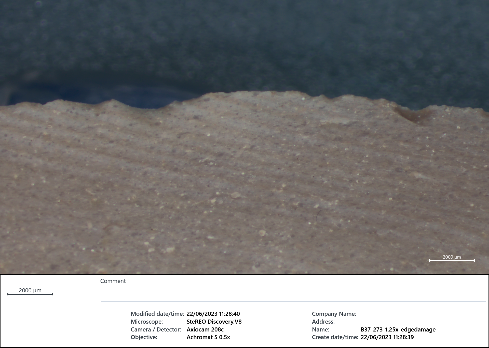
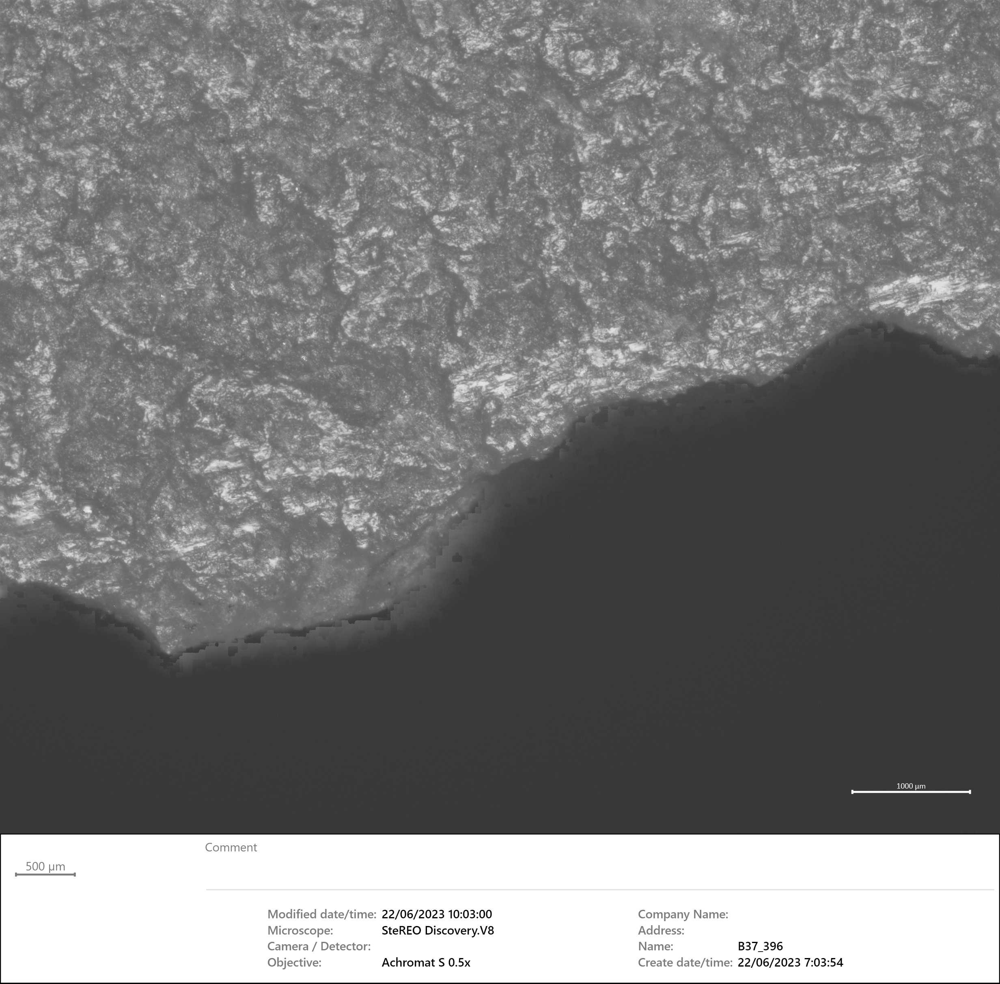

**About**

This project aims to investigate the demands of technological changes
observed in one of the most important changeovers in our history the
Middle-to-Upper Palaeolithic transition. This project explores an
innovative approach to this scientific debate by focusing on the study
of how stone tools were used over time in a key geographic area: the
Levant. The human evolutionary journey is marked by technologies that
helped humans successfully adjust to the Pleistocene dynamics. Such
adaptations have triggered changes in human technological repertoires.
Therefore, how stone tools are designed and used is descriptive of
social and cultural dynamics shaping the evolution of human behaviour
across time. The drivers of technological changes can be diverse, but
ultimately the use of stone tools is key for a toolkit to be retained
and consequently modify the dynamics of a given population.

In the archaeological record, the Middle-to-Upper Palaeolithic
transition, ca. 50 ka to 35 ka cal BP, concerns one of the most
important changeovers in our history. From a technological perspective,
during this transition, changes are observed through the progressive
replacement of surficial Levallois flake technology over into UP
volumetric elongated technologies (blade and bladelets). Understanding
the demands for such technological changes has the potential to
untangle, major processes involved in the evolution of human
technological behaviours. Use-wear studies investigate how stone tool
tools were used, and are, therefore, crucial to identifying the trigger
mechanisms of behavioural shifts and reconstructing the causes of
technological change. Based on use-wear analysis, this project aims to
test whether stone tool changes during the LMP-UP transition are related
to different activities, processed resources, or related to constraints
of social and cultural history (no change on tool use). By addressing
aspects that cannot be assessed by technological and typological
studies, this project has the potential to elucidate the correlation
between changes in the production, design, and use of stone tools during
a key transitional process in our evolutionary journey.

**Research agenda and goals**

Complemented by technological and typological studies (supported by the
listed collaborations), this study also holds the possibility of
recognizing, based on function (differences in tool use even when
technology and typology are retained), new classificatory features that
can be used to identify (when), categorize (how) and interpret (why)
changes that occur in the archaeological repertoire. Therefore, the
project will seek the following objectives: - Identify and characterize
changes in tool use, and correlate these with changes in tool morphology
and design. For this, data on technology, typology, raw material,
experiments, and use-wear analysis will be cross-referenced. - Combine
these with site-specific behavioural data (e.g., fauna, occupation
patterns) and ecological setting (e.g., type of site, landscape) to
infer differences in hunting strategies, mobility, and settlement
patterns. Use-wear data will be integrated into the existing data for
each site and in close collaboration with the different researchers.

For this, the project focuses on well-preserved lithic assemblages which
have been recently excavated from stratified contexts and dated
chronologically. The included key LMP, IUP and EUP (Ahmarian) case
studies from the Levant are: Boker Tachtit (IUP), Far’ah II (LMP), B37
(LMP), B27 (LMP) and Al-Ansab 1 and 2 (IUP-EUP) in the south, and Manot
(EUP) and Amud (LMP) from the northern region (see Fig. 1 and Tab. 1,
appendix, for more details). Combining fields of quantitative artefact
microwear analysis, lithic technology, and typology with experimental
reference libraries, will facilitate an interdisciplinary methodology to
characterize and document the different signatures for tool use. In this
study, standardised data collection, similar analysis protocols and
experimental designs that aim to increase cross-assemblage comparability
will be used to test a series of empirically based hypotheses:

-   Hypothesis 1 (H0): No difference in tool use between assemblages.
    Human technological changes are due to ecological constraints.
    Prediction: It is expected that technological changes are
    diachronically and geographically linked to differences in tool use.
    Macro and micro traces of use-wear will be different among LMP IUP
    and EUP stone tools, showing that these were used to process
    different materials, perform different tasks, or both.
-   Hypothesis 2 (H1): Significant difference in tool use between
    assemblages Technological innovations are likely to be due to the
    constraints of social and cultural history. Prediction: If true, no
    significant link between tool types and their use or performance is
    observed among LMP and IUP stone tools.

{width="679"}

**Team**

PI - João Marreiros, MONREPOS. LEIZA, Mainz

Collaborators - Mae Goder-Goldberger, Department Archaeology, Ben Gurion
University of the Negev - Erella Hovers, Institute of Archaeology, The
Hebrew University of Jerusalem. Israel. - Eduardo Paixão, ICArEHB,
Interdisciplinary Center for Archaeology and Evolution Human Behaviour,
University of Algarve - Ariel Malinsky-Buller, Institute of Archaeology,
The Hebrew University of Jerusalem. Israel.

**Most recent publications related to the project**

-   Hovers, E., 1998. The lithic assemblages of Amud Cave: implications
    for understanding the end of the Mousterian in the Levant. In
    Neandertals and modern humans in western Asia (pp. 143-163). Boston,
    MA: Springer US.
-   Goder-Goldberger, M., Gilead, I., Boaretto, E., Edeltin, L.,
    Horwitz, L.K., Jacoby-Glass, Y., Lavi, R., Neumann, F.H., Porat, N.,
    Toffolo, M.B. and Van Aardt, A.C., 2023. Living in an ecotone: Late
    Middle Palaeolithic occupations in the lower Besor Basin,
    north-western Negev Desert, Israel. Antiquity, 97(394), p.e20.
-   Goder-Goldberger, M., Barzilai, O. and Boaretto, E., 2023.
    Innovative technological practices and their role in the emergence
    of Initial Upper Paleolithic technologies: a view from Boker
    Tachtit. Journal of Paleolithic Archaeology, 6(1), p.11.
-   Goder-Goldberger, M. and Malinsky-Buller, A., 2022. The Initial
    Upper Paleolithic and its place within the Middle-to-Upper
    Paleolithic transition of Southwest Asia: What hides behind the
    curtain of taxonomies?. Journal of Paleolithic Archaeology, 5(1),
    p.2.
-   Martisius, N.L., Spasov, R., Smith, G.M., Endarova, E.,
    Sinet-Mathiot, V., Welker, F., Aldeias, V., Horta, P., Marreiros,
    J., Rezek, Z. and McPherron, S.P., 2022. Initial upper paleolithic
    bone technology and personal ornaments at Bacho Kiro Cave
    (Bulgaria). Journal of Human Evolution, 167, p.103198.
-   Hublin, J.J., Sirakov, N., Aldeias, V., Bailey, S., Bard, E.,
    Delvigne, V., Endarova, E., Fagault, Y., Fewlass, H., Hajdinjak, M.
    and Kromer, B., 2020. Initial upper palaeolithic homo sapiens from
    bacho kiro cave, Bulgaria. Nature, 581(7808), pp.299-302.
