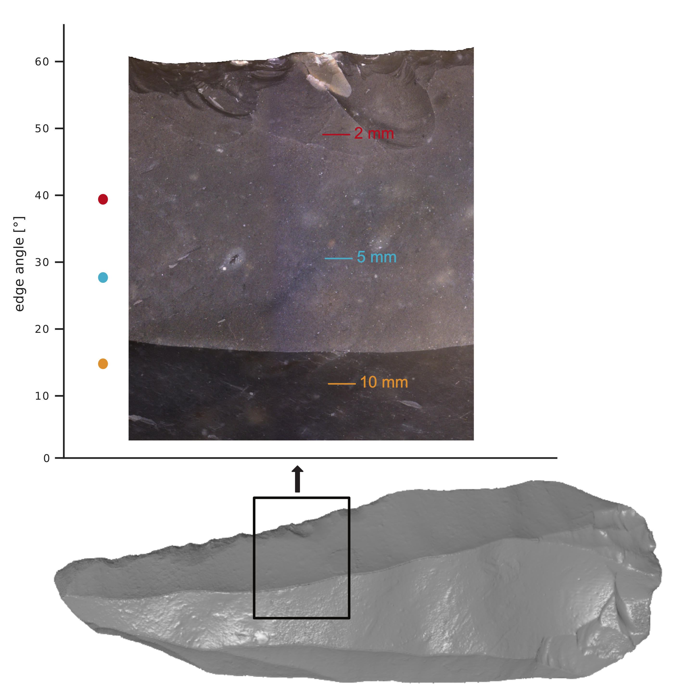
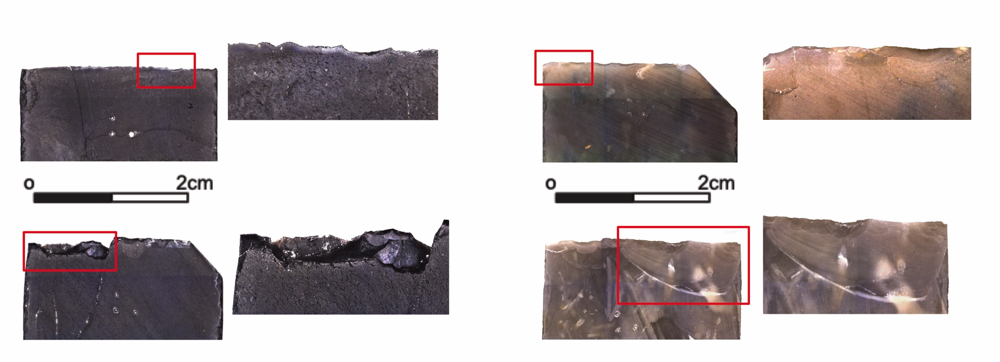

```{=html}
<style>
body {
  text-align: justify;
}
</style>
```
**Rationale**

Archaeologists attempt to answer questions regarding the evolution of
human behaviour through the study of material culture. During the
Pleistocene, stone tools were essential to the survival of hominins.
Hence, the emergence and changes of past human technologies provide
fundamental insights into early hominin behaviour and have been seen as
a combination of cultural traits but also human technological
adaptations and innovations. Understanding the relationship between
production, design, function, and actual use of the huge variety of
stone tools in the archaeological record, and their change over time and
space, is fundamental. Therefore, research that combines studies on tool
design and use is crucial. This understanding can have a major impact on
questions related to the use-life history of a tool, including
technological strategies, tool maintenance, resharpening, and recycling
mechanisms, but also on the nature of human decision-making processes.
This comprehensive research will contribute to answering key questions
related to the study of human technological evolution, as well as the
nature and origin of cultural and social transmission mechanisms among
early hominins. State-of-the-art research has been advocating that a
comprehensive understanding of stone tool use in the past is still
needed. Such an approach can only be achieved when both aspects of tool
design and use are combined. However, such a complementary approach has
so far not been achieved in archaeological research. The relation
between tool design and use can be investigated most effectively in
technological systems showing a minimum of tool variability and instead
evidence of maintenance and long-term use, such as the Middle
Palaeolithic industries. Throughout the Middle Palaeolithic,
technological choices seem consistent, leading to the impression of a
certain stasis and little alteration concerning the composition of
lithic assemblages. Nevertheless, the Late Middle Palaeolithic sites
(late OIS 5 until mid OIS 3; of Central and Eastern Europe are marked by
the presence of a prominent asymmetric tool type). One of these concerns
is the tool function. The tools’ morphology suggests that they could
have been used for different activities, for example, cutting, scraping,
and carving. Thus, interpretations see Keilmesser as a multifunctional
or at least bi-functional tool. This argumentation is based on tool
morphology only and has not been verified through further analysis.
Also, hypotheses related to the potential of an intentionally optimised
design for different tasks have not been tested yet. these questions can
only be addressed by the combination of the different scales of analysis
and methods as techno-typological and material properties studies,
use-wear analysis, and controlled experiments. Investigating and
understanding aspects such as the underlying tool concept and design as
well as tool function and use, here applied to the case study of
Keilmesser, is conditional upon tracing certain behavioural phenomena of
Neanderthals.

{width="389"}

**Research agenda and goals**

This project aims at a unique agenda in the study of past human stone
tools. Data resulting from different approaches will be combined, aiming
at a comprehensive understanding and reconstruction of early stone tool
use. Stone tool design will be investigated through the analysis of
major features observed within archaeological tool variability, such as
raw material properties, tool morphology, edge angle and actual use.
These aspects will be tested experimentally to infer on tool function
and performance, including efficacy, efficiency, and durability, and
against different types of motions and worked materials. Here,
experimental replication will be used to check the performance and
suitability of a tool for a given task. Based on the research questions
and gaps of knowledge earlier identified, the investigation agenda of
this project combines multi-scale research on the overarching topics of
stone tool design and use. This will be explored through different but
interrelated methodological avenues: ***1) archaeological, focusing on
the study of the selected archaeological material. 2) experimental,
building upon the data collected from the archaeological assemblages and
3) computational tools and statistical modelling***. This approach will
enable the development of a multi-scale method of analysis, where
different types of wear traces can be combined and used as diagnostic
features for understanding stone tool use.

By providing new data, methods and models, the project will not only
allow for testing the validity of the preliminary data, but also explore
the unanswered remaining questions. Taken together, this proposed
approach will combine three research avenues, comprising several
supplementing and intertwined methods. Thereby, different scales of
analysis, from macroscopic to microscopic, will highlight possible
determining aspects and correlating factors. All experimental designs
will be built upon data collected from the archaeological samples. This
combination will work on a two-way relation of comparison and testing
between archaeological and experimental assemblages. An assessment of
tool performance will be focused on understanding aspects of tool
effectiveness, efficiency, and durability, and how these relate to the
different features involved in the tool’s design.

{width="466"}

**Team**

Principal Investigators - João Marreiros, TraCEr-MONREPOS. LEIZA,
Mainz - Andreas Hildebrandt, Institut für Informatik, Johannes Gutenberg
University Mainz

Research team - Lisa Schunk, Department of Archaeology, University of
Cambridge - Paolo Sferrazza, TraCEr-MONREPOS. LEIZA, Mainz - Ivan
Calandra, MONREPOS. LEIZA, Mainz - Walter Gneisinger, TraCEr-MONREPOS.
LEIZA, Mainz

Collaborators - Alastair Key. Department of Archaeology, University of
Cambridge - Andrzej Wisniewski. Institute for Archaeology, Faculty of
Historical and Pedagogical Sciences, University of Wroclaw - Olaf. Joris
MONREPOS. LEIZA, Mainz - Marcel Weiß. Institut fur Ur- und
Fruhgeschichte, Friedrich-Alexander-Universitat Erlangen-Nurnberg - Petr
Neruda, Moravské zemské muzeum, Brno

**Publications related to the project**

-   Marreiros, J., Calandra, I., Gneisinger, W., Paixão, E.,
    Pedergnana, A. and Schunk, L., 2020. Rethinking use-wear analysis
    and experimentation as applied to the study of past hominin tool
    use. Journal of Paleolithic Archaeology, 3, pp.475-502..
-   Schunk, L., Gneisinger, W., Calandra, I. and Marreiros, J., 2023.
    The role of artificial contact materials in experimental use-wear
    studies: A controlled proxy to understand use-wear polish formation.
    Journal of Archaeological Science: Reports, 47, p.103737.
-   Hildebrandt, A.K., Stöckel, D., Fischer, N.M., de la Garza, L.,
    Krüger, J., Nickels, S., Röttig, M., Schärfe, C., Schumann, M.,
    Thiel, P. and Lenhof, H.P., 2015. Ballaxy: web services for
    structural bioinformatics. Bioinformatics, 31(1), pp.121-122..
-   Marreiros, J., Pereira, T. and Iovita, R., 2020. Controlled
    experiments in lithic technology and function. Archaeological and
    Anthropological Sciences, 12, pp.1-7.).
-   Werner, S., Schmidt, L., Marchand, V., Kemmer, T., Falschlunger, C.,
    Sednev, M.V., Bec, G., Ennifar, E., Höbartner, C., Micura, R. and
    Motorin, Y., 2020. Machine learning of reverse transcription
    signatures of variegated polymerases allows mapping and
    discrimination of methylated purines in limited transcriptomes.
    Nucleic acids research, 48(7), pp.3734-3746.
-   Schunk, L., Cramer, A., Bob, K., Calandra, I., Heinz, G., Jöris, O.
    and Marreiros, J., 2023. Enhancing lithic analysis: Introducing
    3D-EdgeAngle as a semi-automated 3D digital method to systematically
    quantify stone tool edge angle and design. Plos one, 18(11),
    p.e0295081.
-   Calandra, I., Gneisinger, W. and Marreiros, J., 2020. A versatile
    mechanized setup for controlled experiments in archeology. STAR:
    Science & Technology of Archaeological Research, 6(1), pp.30-40.
-   Calandra, I., Schunk, L., Bob, K., Gneisinger, W., Pedergnana, A.,
    Paixao, E., Hildebrandt, A. and Marreiros, J., 2019. The effect of
    numerical aperture on quantitative use-wear studies and its
    implication on reproducibility. Scientific reports, 9(1), p.6313.
