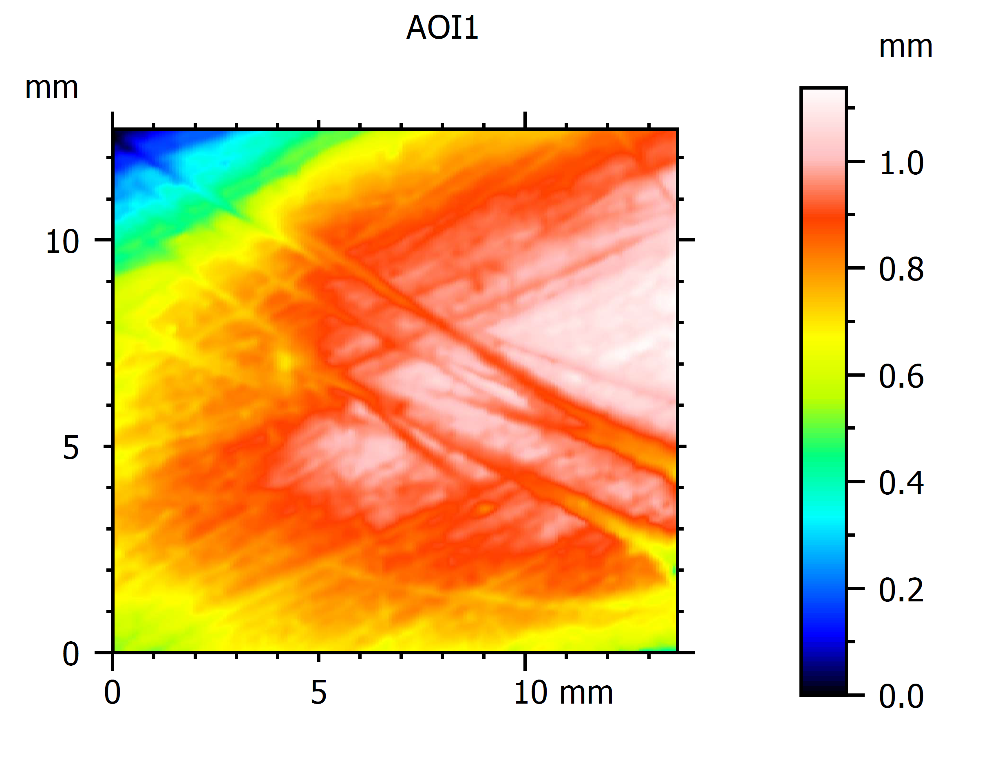

# **About my research**

I am passionate about the past! I find myself constantly fascinated by the human capacity to invent and innovate. From the earliest stone tools to the grandeur of the pyramids and today’s touchscreen devices, I see technological change as deeply intertwined with the development of social behaviours throughout human history. I’m particularly captivated by the question of why our ancestors chose not only to innovate but also to invent new tools. This phenomenon is, in my view, central to understanding our species’ unique trajectory. It’s this cumulative process that has shaped who we are today.

My research focuses on our deep past, the Palaeolithic. The Palaeolithic record is marked by several transitional moments, which are characterised by the appearance of technological diversity, especially in stone tools. While decades of research have helped us classify and date these technologies, we still know surprisingly little about how they were used. This gap in knowledge drives my work. I believe that to truly understand why technological changes occurred, we must investigate the function of such technologies. 
The drivers of change can be non-functional, but after all, tools are made to be used. Consequently, these are not just artefacts; they are reflections of behaviour. Understanding their use reveals the practical and social demands of past societies and helps explain why certain technologies were retained, modified, or discarded. 
I tend to frame technological change within two conceptual models: revolutionary breakthroughs (such as inventions or losses) and incremental innovations. From my perspective, both are linked to tool use. My research investigates how tool function, and recently, tool performance, shaped behavioural adaptations.
To illustrate, I often reflect on modern examples like the evolution of telephones, from early “sound telegraphs” to smartphones. In this case, for example, we know that changes in the function of telephones led to changes in how we interact socially.
In the same way, I aim to uncover how prehistoric tools, and the ways they were used, shaped the lives, behaviours, and social structures of our ancestors.

To do so, I, together with several collaborators, focus my research on key transitional moments in the Palaeolithic record, such as the Late Middle Palaeolithic-Initial Palaeolithic transition, and in geographic regions where these transitions seem to be present (such as North Africa, Ethiopia, Central Europe, Levante and Caucasus).
From the methodological point of view, I am very keen on developing new methods and techniques that allow us to investigate artefacts. In this field, I am particularly interested in doing lab-controlled experiments and quantitative methods and techniques applied to the study of traces of use. 

