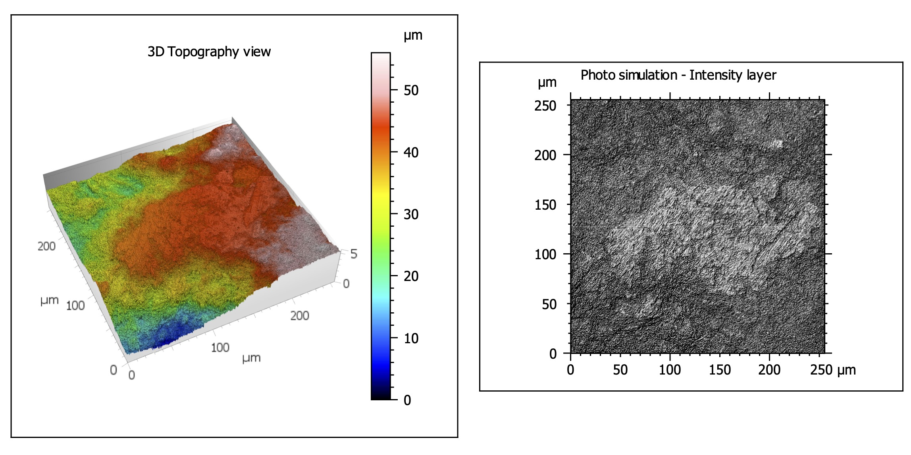
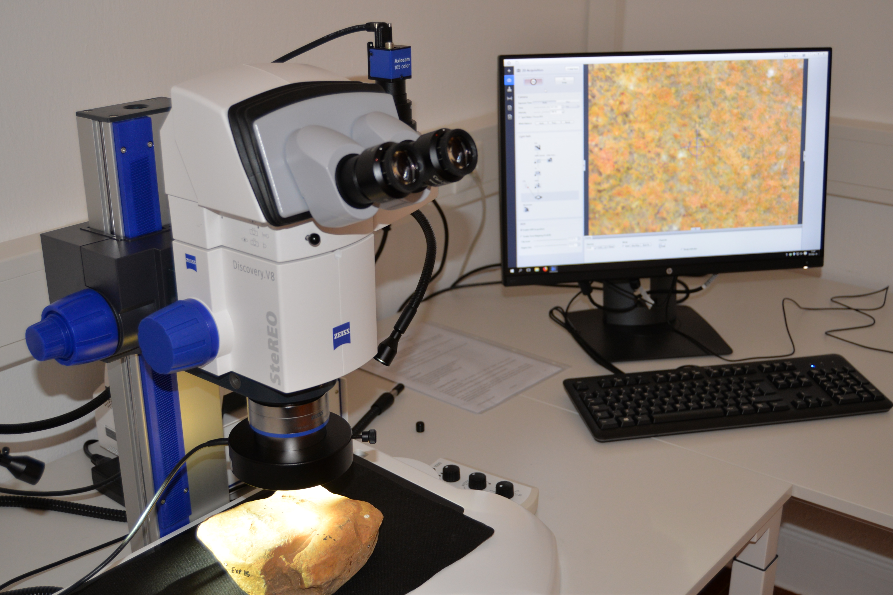
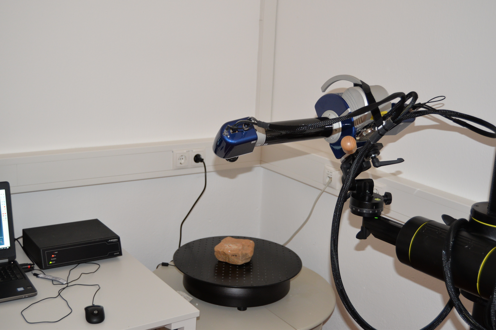
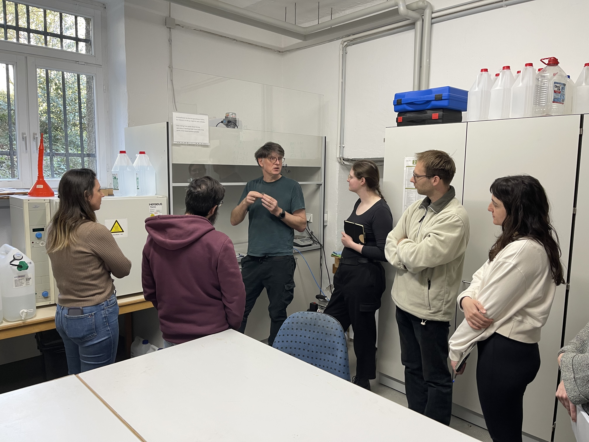
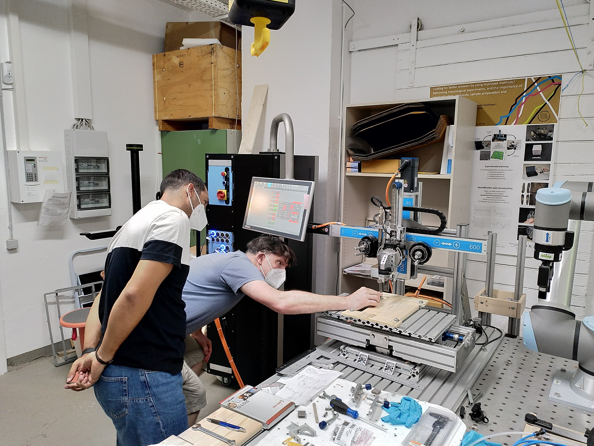

**About**

      
The Laboratory for Traceology and Controlled Experiments (TraCEr) runs under the research umbrella of the MONREPOS Archaeological Research Centre and Museum for Human Behavioural Evolution, namely, understanding the evolution of our behaviour during the early history of humanity. 

In Pleistocene Archaeology, interpreting artefact variability in the archaeological record has long been one of the most debated topics, mainly related to different types of raw materials and their possible use by past humans. In fact, to what uses humans put their tools and how these might have varied through time and space is one of the key areas of research for understanding the evolution of human behaviour. The very presence of diverse types of materials in artefacts assemblages shows that humans managed different resources and, therefore, technology was characterized by the production of different tools made from materials with different properties. Functional studies are of major importance in order to determine and understand artefact use, and thus to address fundamental questions about the evolution of human behaviour. The main scope of TraCEr is to carry ground-breaking functional studies that combine 1) methodological development and 2) fundamental research on Pleistocene and Early Holocene archaeology.

**Methods**

By developing innovative and controlled experimental protocols, as well as high-resolution 3D imaging techniques, methods will be improved in order to assess the formation criteria of use-wear traces on different types of materials found in the archaeological record (this involves organic, such as hard animal materials, but also non-organic, such as stone tools). Methodological apparatus (i.e. mechanical devices) will be used to improve experimental validation, establish protocols and define standards, contributing to establishing standards in the experimental protocols and in the data acquisition, documentation and quantification on use-wear studies.

Building on current use-wear methods and techniques, our research will follow three avenues:

a)  Controlled experiments will be designed to improve the identification, measurement, and analysis of all major variables involved. Factors affecting use-wear formation will be identified and tested individually to understand which of these variables influence the formation of the different types of use-wear traces.

b)  One often neglected factor is the range of raw materials properties (e.g. hardness, roughness); the lab will also assess the properties of the tested materials, and their influence on the results.

c)  High-resolution 3D imaging methods will be applied to document, quantify and interpret use-wear traces on both experimental and archaeological samples. 3D digital data will be quantified to both minimize potential sources of error/bias and to generate data that can be statistically tested. Digital data will be made available in an open access library to other researchers.

**Facilities and equipment**

*Imaging laboratory*

The imaging laboratory will be dedicated to macroscopic and microscopic imaging, including the following five main pieces of equipment (please find more details [here](https://monrepos.leiza.de/en/raeumlichkeiten/)):

-   3D structured-light scanner, Aicon SmartScan-HE R8
-   Upright light microscopes for reflected and transmitted light, Zeiss AxioScope.A1 and AxioLab.A1
-   Stereo-microscope, Zeiss SteREO Discovery.V8
-   3D digital microscope, Zeiss Smartzoom 5
-   Upright light microscope, Zeiss Axio Imager.Z2 Vario, coupled to a 3D laser-scanning confocal microscope, Zeiss LSM 800 MAT
-   Scanning electron microscope, Zeiss EVO 25, coupled to an energy-dispersive X-ray spectroscopy detector, Bruker Quantax XFlash 6\|30M

  
  
  
  

*Sampling laboratory*

The Sampling lab will be used for preparing all different types of samples, including different materials used for experiments and archaeological artefacts for analysis.

*Reference archive*

The office and archive room includes office desks and a reference library for state-of-the-art bibliography on use-wear and controlled experiments regarding theoretical background, methods and techniques, and also archaeological case studies. This room also hosts the TraCEr use-wear experimental reference collection.

  
  
  

*Experimental workshop*

The experimental workshop is equipped to test different materials and activities. Experimental setups will be as controlled as possible, combining several mechanical appliances and material properties testers.

  
  
  

**Team**

Integrated members

-   [Joao Marreiros](https://www.researchgate.net/profile/Joao-Marreiros-3), Research Group Leader

-   [Jerome Robitaille](https://www.researchgate.net/profile/Jerome-Robitaille-2), Postdoctoral researcher

-   [Paolo Sferraza](https://www.researchgate.net/profile/Paolo-Sferrazza), Postdoctoral researcher

-   Tamrat Habtu, PhD candidate

-   [Ivan Calandra](https://www.researchgate.net/profile/Ivan-Calandra), Senior researcher

-   [Walter Gneisinger](https://www.researchgate.net/profile/Walter-Gneisinger), Lab technician

-   [Tamara Dagondzic](https://www.researchgate.net/profile/Tamara-Dogandzic), Senior researcher

-   Geoff Carver, Software engineer

Affiliated members

-   [Eduardo Paixao](https://www.researchgate.net/profile/Eduardo-Paixao), Postdoctoral researcher, ICArEHB-UAlg

-   [Lisa Schunk](https://www.researchgate.net/profile/Lisa-Schunk), Postdoctoral researcher, University of Cambridge

-   [Daniela Holst](https://www.researchgate.net/profile/Daniela-Holst), Postdoctoral researcher, University of Cologne

-   [Youssef Djellal](https://www.researchgate.net/profile/Youssef-Djellal), PhD candidate, ICArEHB-UAlg

-   [Anastasia Eleftheriadou](https://www.researchgate.net/profile/Anastasia-Eleftheriadou), PhD candidate, ICArEHB-UAlg

-   [Patricia Bello-Alonso](https://www.researchgate.net/profile/Patricia-Bello-Alonso), Postdoctoral researcher, University of Vigo

-   Alexandra Dermeková, MA student, Masaryk University

-   [Ejder Babazade](https://www.researchgate.net/profile/Ejder-Babazade-2), PhD candidate, Azerbaijan National Academy of Sciences

Former members

-   [Antonella Pedergnana](https://www.iceman.it/en/the-team/)

-   [Ulrich Thaler](https://www.smac.sachsen.de/ueberuns.html)

**Recent Publications**

-   Schunk, L., Calandra, I., Cramer, A., Gneisinger, W. and Marreiros, J., 2024. Past human decision-making based on stone tool performance: Experiments to test the influence of raw material variability and edge angle design on tool function. Journal of Archaeological Science, 167, p.106003.
-   Rausch, H., Marreiros, J., Kullmer, O., Schunk, L., Gneisinger, W. and Calandra, I., 2024. An experimental approach on dynamic occlusal fingerprint analysis to simulate use-wear localisation and development on stone tools. Scientific Reports, 14(1), p.20084.
-   Schunk, L., Cramer, A., Bob, K., Calandra, I., Heinz, G., Jöris, O. and Marreiros, J., 2023. Enhancing lithic analysis: Introducing 3D-EdgeAngle as a semi-automated 3D digital method to systematically quantify stone tool edge angle and design. Plos one, 18(11), p.e0295081.
-   Marreiros, J., Thaler, U. and Macdonald, D.A., 2023. Editorial paper special issue “Contact materials: The ‘Other’in experimental use-wear studies”. Journal of Archaeological Science: Reports, p.104147.
-   Schunk, L., Gneisinger, W., Calandra, I. and Marreiros, J., 2023. The role of artificial contact materials in experimental use-wear studies: A controlled proxy to understand use-wear polish formation. Journal of Archaeological Science: Reports, 47, p.103737.
-   Paixão, E., Marreiros, J., Dubreuil, L., Gneisinger, W., Carver, G., Prévost, M. and Zaidner, Y., 2022. The Middle Paleolithic ground stones tools of Nesher Ramla unit V (Southern Levant): A multi-scale use-wear approach for assessing the assemblage functional variability. Quaternary International, 624, pp.94-106.
-   Paixao, E., Pedergnana, A., Marreiros, J., Dubreuil, L., Prevost, M., Zaidner, Y., Carver, G. and Gneisinger, W., 2021. Using mechanical experiments to study ground stone tool use: Exploring the formation of percussive and grinding wear traces on limestone tools. Journal of Archaeological Science: Reports, 37, p.102971.
